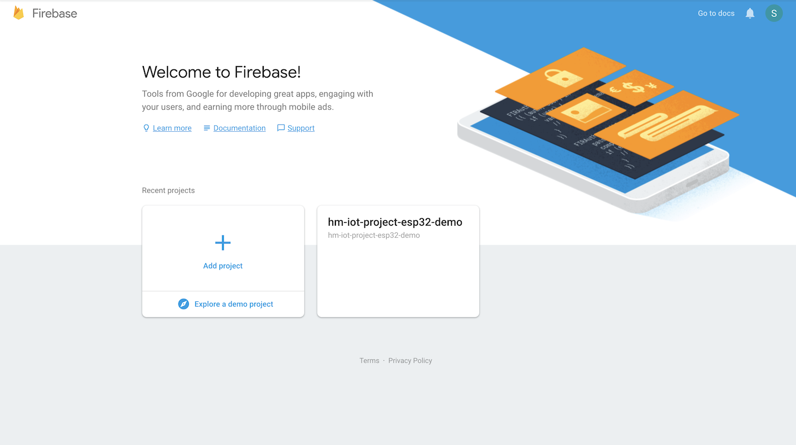
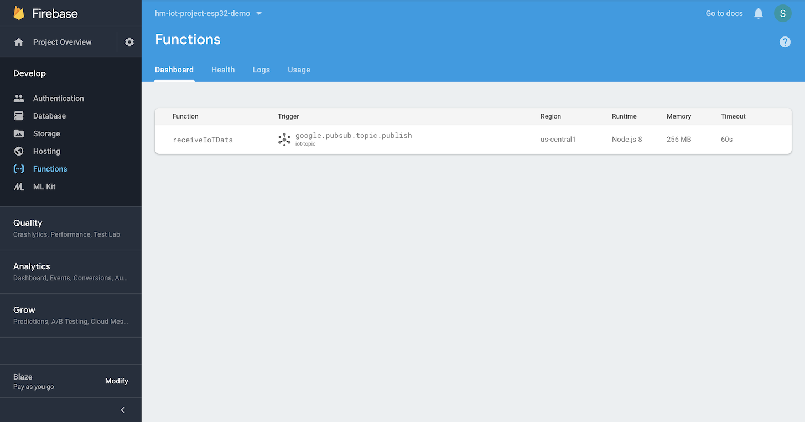

# himinds-iot-project-cloud-gcp-cloud-functions

## Overview
Several different GCP cloud functions to handle data from IoT devices and work with GCP database solutions. This project is the back-end part of the 
[ESP32 IoT client that connects to the Google IoT Core](https://github.com/HiMinds/himinds-iot-project-embedded-esp32-mongoose-gcp-iot-client/) project.

## Highly recommended links
* [Build a Weather Station using Google Cloud IoT Core and MongooseOS](https://medium.com/google-cloud/build-a-weather-station-using-google-cloud-iot-core-and-mongooseos-7a78b69822c5)
* [Scalable IoT Integration
](https://coertvonk.com/sw/embedded/sonoff-mqtt-google-actions-23997)
* [Bike Route Data Gatherer
](https://www.hackster.io/PaulTR/bike-route-data-gatherer-12a831)

## Technology stack:

* [Google Cloud Functions](https://cloud.google.com/functions/)
* [Firebase Realtime Database](https://firebase.google.com/docs/database/)
* [Cloud Firestore](https://firebase.google.com/docs/firestore/)
* [Google BigQuery](https://cloud.google.com/bigquery/)

## Creating your own project

```bash
firebase init
```

Select:
* Functions: __Configure and deploy Cloud Functions__
* Default Firebase project: __[YOUR PROJECT]__ 
* What language would you like to use to write Cloud Functions? __JavaScript__
* Do you want to use ESLint to catch probable bugs and enforce style? __Yes__
* Do you want to install dependencies with npm now? __Yes__

Edit your package.json and add:

```json
 "engines": {
    "node": "8"
  }
```
to get Version 8 of NodeJS (Promises :heart_eyes: )

## Prerequisite

Install firebase tools.
```bash
npm install -g firebase-tools
```
I have created the account "hm-iot-project-esp32-demo" via [Firebase Console](https://console.firebase.google.com/)



```bash
firebase list
```

will show the following:

| Name | Project ID Instance | Permissions |
--- | --- | ---
| hm-iot-project-esp32-demo | hm-iot-project-esp32-demo | Owner |


## Usage:

```bash
firebase login
```

or first 

```
firebase logout
```
If you need to switch accounts.

cd into the directory cloud-function-pubsub-database

```bash
cd cloud-function-pubsub-database/
```

```bash
cd functions/
```

To deploy the functions to the cloud type:

```bash
firebase deploy
```

```bash
firebase deploy
Error: No project active. Run with --project <projectId> or define an alias by
running firebase use --add
```

```bash
firebase deploy --project hm-iot-project-esp32-demo
```


When the function is deployed, is will look like this in the firebase console:




## Google Cloud Functions Events

A platform event is something that triggers a Google Cloud Function to execute. Here are some examples:

* An HTTP Trigger (e.g., for a REST API)
* A pubSub event (e.g., run function when message is sent to topic)
* A Storage event (e.g., Image uploaded into bucket)

### How about using cloud functions for Cron jobs?
Unfortunately, there is no easy way to trigger your cloud functions based on a schedule. In the following [project](https://github.com/FirebaseExtended/functions-cron), Google describes how to create an App Engine that provides a Cron service.

## The Source Code
This project is the back-end part of the 
[ESP32 IoT client that connects to the Google IoT Core](https://github.com/HiMinds/himinds-iot-project-embedded-esp32-mongoose-gcp-iot-client/) project.

The cloud function is triggered by a pubSub event from the IoT core. It is called "iot-topic". We parse the data from our ESP32 and create the following JSON structure:


```json
 {
  uptime: payload.uptime,
  temp: payload.temp,
  freeRam: payload.free_ram,
  deviceId: deviceId,
  timestamp: context.timestamp
  }
```
As seen above the timestamping is done in the cloud function and not on the ESP32. This should be changed later on, it is always better to timestamp the data as close to the source as possible to get the best possible accuracy of the timestamp.

The data structure is stored in:

* [Firebase Realtime Database](https://firebase.google.com/docs/database/)
* [Cloud Firestore](https://firebase.google.com/docs/firestore/)
* [Google BigQuery](https://cloud.google.com/bigquery/)

This is done in the functions:

```javascript

function updateFirebaseRealtimeDatabase(data){}

function updateCloudFirestore(data){}

function insertIntoBigquery(data){}

```
We use Promise.all to call the functions that wait for all to be fulfilled (or the first function to perform a rejection).
.then() automatically returns a promise so we do not need to resolve or reject the promise.


```javascript

Promise.all([insertIntoBigquery(data), updateFirebaseRealtimeDatabase(data),updateCloudFirestore(data)]);

```